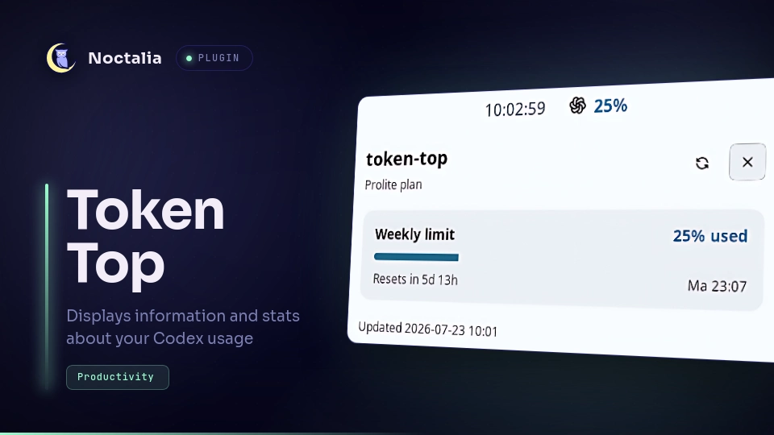
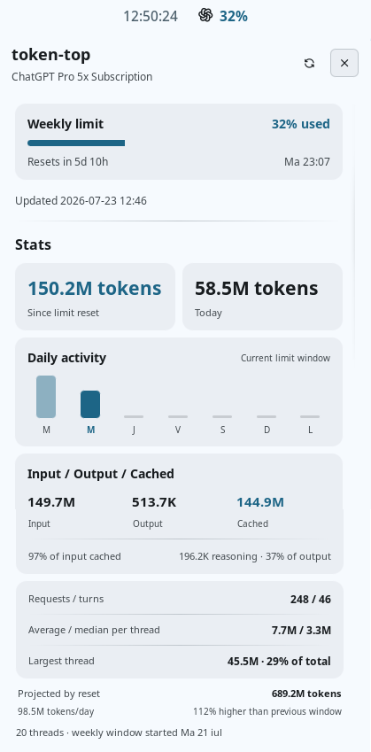

# token-top

Track your Codex quota and session usage from the Noctalia bar.

## Get started

1. Install [ripgrep](https://github.com/BurntSushi/ripgrep) and sign in with `codex login`.
2. In Noctalia > Plugins, add `https://github.com/spinualexandru/token-top-noctalia` as plugin source
3. Enable `spinualexandru/token-top` in Noctalia and add the **token-top** widget to your bar.
4. Click the widget to see your usage details.
