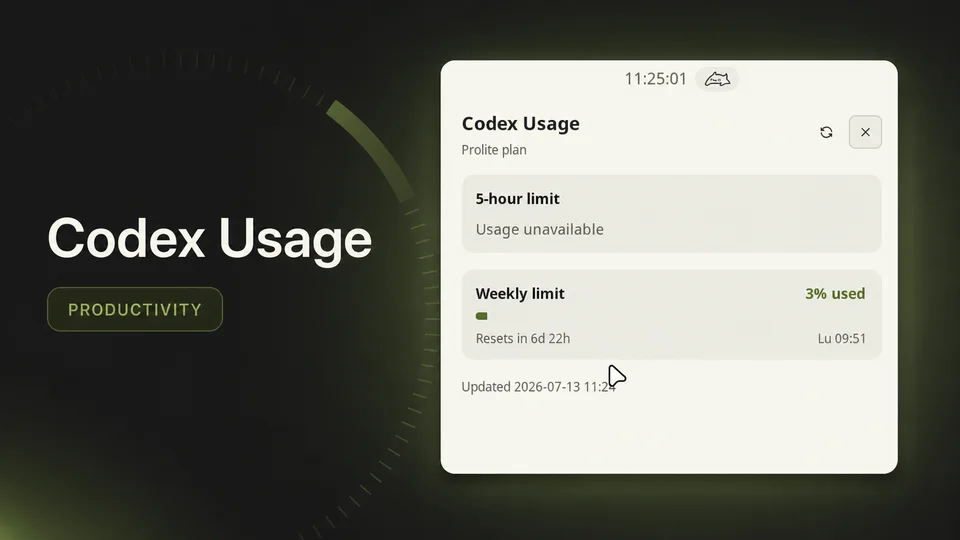

# Codex Usage



Track the percentage of your Codex quota consumed in the current 5-hour and weekly windows.

## Features

- Compact percentage-only 5-hour and weekly usage values in the Noctalia bar, with an option to hide the 5-hour value.
- An attached details panel with optional 5-hour usage, weekly progress, reset countdowns, the current plan, and the last successful refresh.
- Automatic refresh when Noctalia starts and every five minutes afterward.
- A manual refresh button in the details panel.
- Duration-based window detection, so weekly-only and reordered API responses are labelled correctly.

## Usage

1. Make sure you are logged into Codex

   ```sh
   codex login
   ```

2. Enable `spinualexandru/codex-usage` and add the **Codex Usage** widget to a bar.
3. Click the widget to open the details panel. The bar values and progress bars show percentage consumed, not percentage remaining.

The plugin uses the active OAuth account from `$CODEX_HOME/auth.json`, or `~/.codex/auth.json` when `CODEX_HOME` is
unset. If credentials expire or are rejected, run `codex login` again; this plugin deliberately does not refresh or
rewrite credentials.

## Dependencies

None.

## Settings

- **Show 5-hour limit in bar:** shows the 5-hour percentage and tooltip row. Enabled by default.
- **Show 5-hour limit in panel:** shows the 5-hour card in the details panel. Enabled by default.

When both options are disabled, the plugin stops retaining and publishing the 5-hour window. Codex supplies the
5-hour and weekly windows through one usage endpoint, so the shared five-minute request continues to keep weekly usage
current. The panel also provides a manual refresh.

## Side effects

- **Filesystem reads:** reads the active Codex `auth.json` before each request.
- **Network:** sends an authenticated `GET` request to `https://chatgpt.com/backend-api/wham/usage` to retrieve quota
  percentages and reset times. Requests honor Noctalia's offline mode.
- **Filesystem writes:** none.
- **Spawned processes:** none.

The access token is kept only inside the polling service while a request is made. It is never copied into Noctalia
shared state, logs, tooltips, notifications, or screenshots. When a refresh fails, the last successful usage snapshot
remains visible and is marked stale.

## Troubleshooting

- **`auth.json` was not found:** run `codex login`, then refresh from the panel.
- **OAuth credentials are missing:** API-key-only Codex configuration cannot access ChatGPT subscription quotas; sign
  in with `codex login`.
- **Credentials were rejected:** sign in again with `codex login`.
- **Usage request failed:** check Noctalia's offline mode and your network connection. The previous successful values,
  if any, remain visible.
